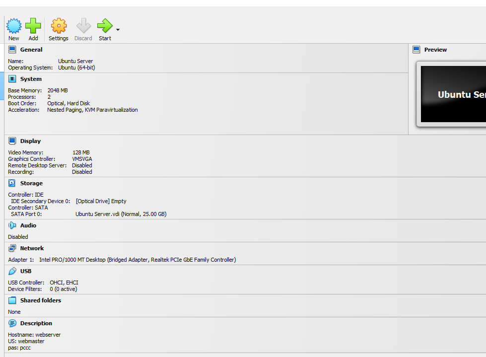
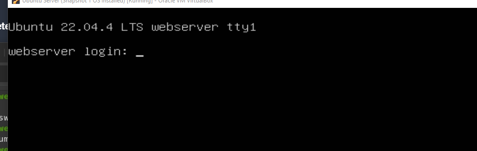
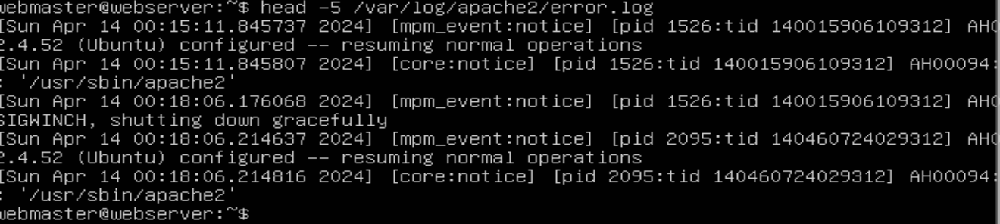

### Caroline Wallace
##### CIS-106
##### Spring 2024

# Deliverable 2

1. ### Server Specifications 
2. ### Log in screen
3. ### What is the IP address of your Ubuntu Server Virtual Machine?
   192.168.17.195
4. ### How do you enable the Ubuntu Firewall?
   sudo ufw enable
5. ### How do you check if the Ubuntu Firewall is running?
   sudo ufw status
6. ### How do you disable the Ubuntu Firewall?
   sudo ufw disable
7. ### How do you add Apache to the Firewall?
   sudo ufw allow 'Apache'
8. ### What is the command you used to install Apache?
   sudo apt install apache2 -y
9.  ### What is the command you use to check if Apache is running?
    sudo systemctl status apache2 --no-pager
10. ### What is the command you use to stop Apache?
    sudo systemctl stop apache2
11. ### What is the command you use to restart Apache?
    sudo systemctl restart apache2 ssh
12. ### What is the command used to test Apache configuration?
    sudo apche2ctl configtest
13. ### What is the command used to check the installed version of Apache?
    sudo systemctl status apache2
14. ### What are the most common commands to troubleshoot Apache errors? Provide a brief description of each command.
 * systemctl - used to control and manage servers 
    * apachectl - used to check the Apache config files for error
    * journalctl - used to query and view the logs
15. ### Which are Apache Log Files, and what are they used for? Provide examples and screenshots.
 Apache logs contain records of the web servers. You can use the head, cat, tail, etc- command to view these logs. 
    